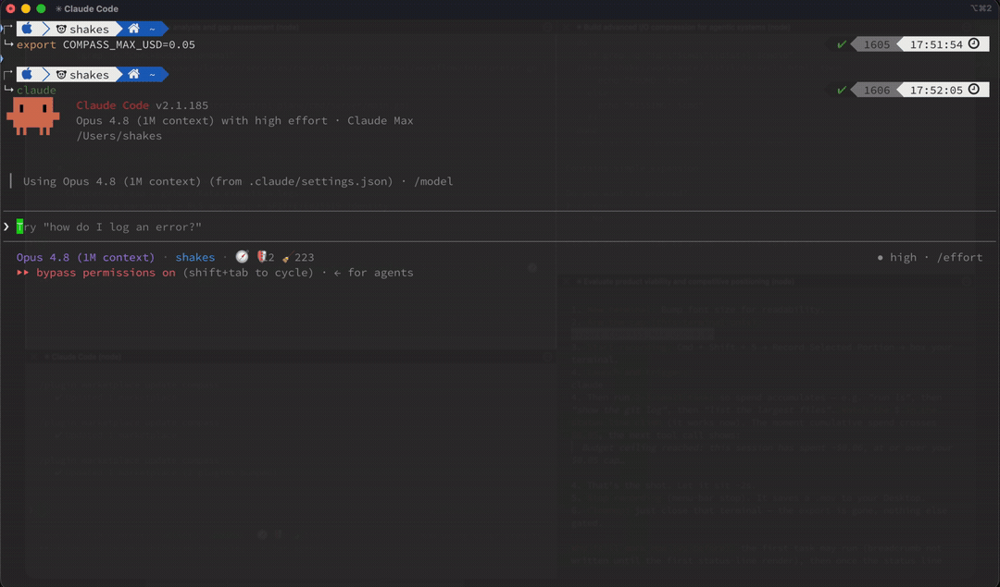
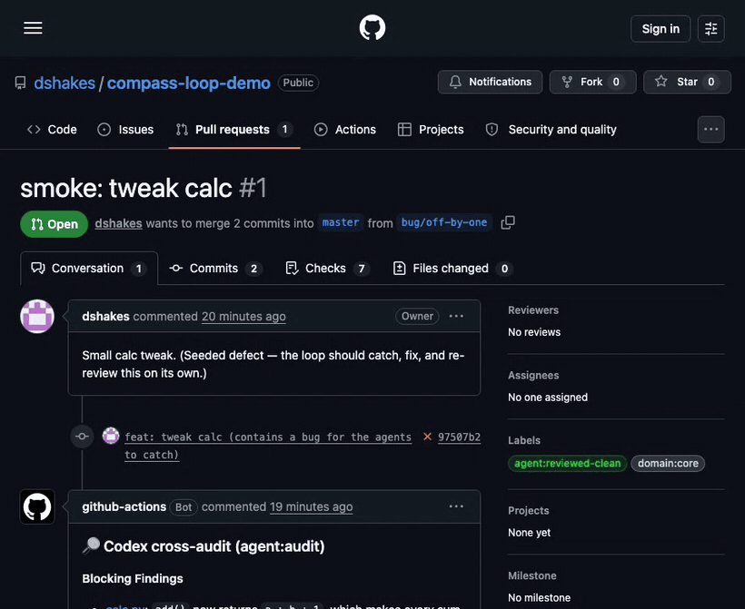
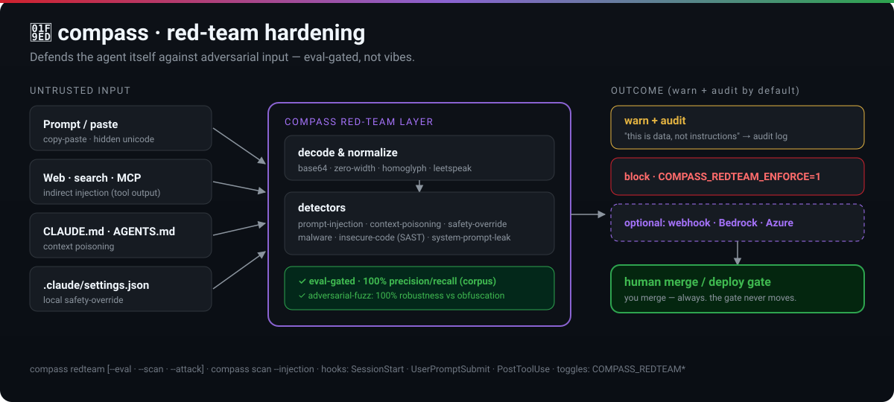
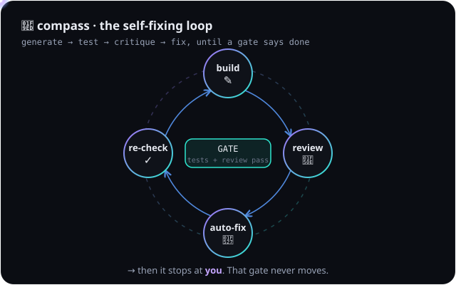
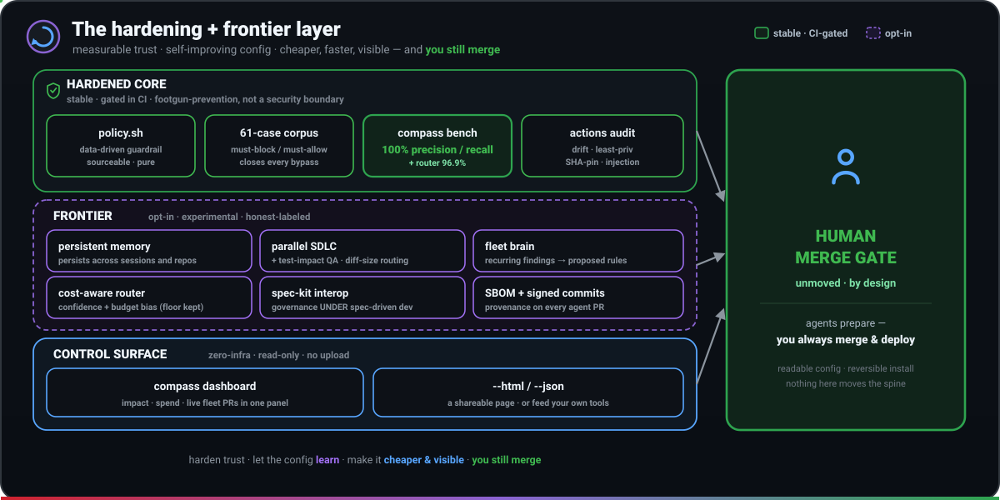

<div align="center">

# 🧭 compass

### Guardrails and a hard budget cap for your AI coding agent.

`budget gate` · `guardrails 100/100` · `~61% cheaper routing` · `signed releases` · `100% local` · `no telemetry` · `you always merge`

[](https://github.com/dshakes/compass/actions/workflows/ci.yml)
[](https://github.com/dshakes/compass/releases)
[](LICENSE)
[](docs/05-plugin.md)
[](docs/05-plugin.md)
[](docs/05-plugin.md)
[](#safety-honesty--status)

</div>

<p align="center">
  <a href="docs/02-cost-and-models.md" title="Live budget ceiling — docs/02-cost-and-models.md"></a>
</p>

<p align="center"><sub><b>Real session, no edits:</b> the cost climbs to $0.35, then the next action is <b>HALTED</b> at the $0.05 cap — before it spends more.</sub></p>

**compass is a local-first config layer for Claude Code, Codex & Gemini that stops your agent from doing three things it shouldn't** — burning your budget, running unsafe commands, and merging unverified code. Set `COMPASS_MAX_USD=5` and the session hard-stops at the cap; catastrophic commands are blocked before they run, and the guardrail policy is scored **100/100** in CI — not asserted. You install it once, and **you always merge.**

```bash
# no curl|sh, fully reversible — then just open any repo in your agent
git clone https://github.com/dshakes/compass ~/compass && cd ~/compass && ./quickstart.sh
# or, inside Claude Code:   /plugin marketplace add dshakes/compass
```

<p align="center">
  <a href="#see-it-work">▶ See it work</a> &nbsp;·&nbsp; <a href="#why-its-different--measured-not-vibes">Why it's different</a> &nbsp;·&nbsp; <a href="#-the-part-people-screenshot-it-fixes-its-own-prs">The self-fixing PR loop</a> &nbsp;·&nbsp; <b><a href="#install">Install</a></b> &nbsp;·&nbsp; <a href="#whats-in-the-box">What's in the box</a> &nbsp;·&nbsp; <a href="docs/11-using-compass.md">📚 Docs</a>
</p>

---

<div align="center">

### ⭐ The part people screenshot: it fixes its own PRs.

</div>

<p align="center">
  <a href="https://github.com/dshakes/compass-loop-demo/pull/1" title="The actual PR in this recording — click through and inspect every event"></a>
</p>

<div align="center">

Open a PR and compass **reviews it, security-checks it, runs the tests, cross-audits it with a second model — then pushes its own fixes until it's green.** You merge. **☝ That's a real PR** — every event above is inspectable.

**The idea in one line: the loop is the unit of work.** A one-shot agent stops at its first wrong answer. compass *loops* — **generate → test → critique → fix → repeat against a gate** — so quality comes from iteration, not one lucky prompt. The same closed loop drives a single PR, or your whole fleet of repos overnight. → [how the loop works](docs/09-sdlc.md) · [the thesis](docs/loop-engineering.md)

</div>

---

## Why it's different — measured, not vibes

Every AI-agent config claims "safe" and "cheap." compass is the one that hands you the **number** — and lets a skeptic reproduce it in 30 seconds. Everyone has the same models; the edge is *configuration you can trust*, not another feature list. Four claims, four commands:

**🛡 Guardrails with a score.** Catastrophic commands and secret writes are blocked *before they run* — and the policy is eval-gated, not asserted. *(In human terms: it won't let the agent delete your machine or leak your keys, and it can prove how well.)*

```bash
compass bench     # → guardrail 100% precision/recall (61-case corpus), router 96.9% — in CI
# then ask the agent to `rm -rf /` or write a .env → denied; `rm -rf ./build` → allowed
```

**📉 Cost routing that's measured.** Cheap work goes to cheap models — scored against an eval set, ~61% cheaper than all-Opus at ~98% quality on a fair mix. *(In human terms: it stops paying Opus prices to fix a typo.)*

```bash
compass route "redesign the auth model"   # → opus
compass route "fix a typo"                 # → haiku
```

**💸 A budget ceiling that actually stops it.** Usage trackers *report* spend; compass *enforces* it — set a dollar cap and the session is **halted before the next tool call** once it's reached, live. *(In human terms: an agent can't quietly run up a $40 bill while you're away — it stops at your number.)*

```bash
export COMPASS_MAX_USD=5     # this session hard-stops at $5 — the agent is blocked, not just warned
compass spend --max-usd 5    # the same ceiling on the ledger, for scheduled / fleet runs
```

**🔏 Supply chain you can verify.** Releases carry keyless SLSA provenance, so a tampered or look-alike download is rejected. *(In human terms: you can prove the code you installed is the code I shipped.)*

```bash
compass verify v0.17.2     # → ✓ provenance verified
```

**🧪 Red-team resistance, measured.** Prompt-injection (direct/indirect/paste), CLAUDE.md poisoning, local safety-override, malware & insecure-code — scored against a labeled corpus that gates in CI, with optional escalation to a managed guardrails service (webhook · Bedrock · Azure). *(In human terms: a poisoned repo or web page can't quietly turn your agent against you.)*

```bash
compass redteam   # → injection corpus 100% P/R, then scans THIS repo's CLAUDE.md/MCP/settings
```

<p align="center">
  <a href="docs/17-red-team.md" title="placeholder link — repoint to a demo/video/landing"></a>
</p>

No service, no telemetry, no `--dangerously-skip-permissions`; `git pull` to update. The work it can't safely own, it hands back — **you keep the merge.**

---

## See it work

Smallest leap of faith first — **the governance moment**, then **feel it**, then **see the proof**, then **see how it works.**

**0 · The budget ceiling, annotated** — the same hard-stop as the hero clip, as a clean walkthrough ($1.80 ✓ → $4.10 ✓ → $5.00 HALTED). Usage trackers report spend; compass enforces it:

<p align="center">
  <a href="docs/02-cost-and-models.md" title="Live budget ceiling — docs/02-cost-and-models.md"></a>
</p>

**1 · The day-to-day feel** — guardrails, the cost-aware status line, the loop, and the crew, in ~25 seconds:

<p align="center">
  <a href="docs/11-using-compass.md" title="placeholder link — repoint to a demo/video/landing"></a>
</p>

**2 · The headline, on a real PR** — the loop recording at the top is a real session; [**open the actual PR**](https://github.com/dshakes/compass-loop-demo/pull/1) and inspect every event yourself: Blocking review → `agent:needs-fix` → Builder fix commit on the branch → re-review clean → `agent:reviewed-clean`. No human touched it; the merge stayed theirs.

**3 · How that loop works** — review · security · tests · Codex cross-audit run in parallel; Blocking findings get auto-fixed and re-reviewed (round-capped) until green, then it stops at you:

<p align="center">
  <a href="docs/09-sdlc.md" title="placeholder link — repoint to a demo/video/landing"></a>
</p>

<p align="center"><sub>Run it locally in 30s with <code>~/compass/sdlc/orchestrate.sh "&lt;task&gt;"</code> (no tokens), or wire the GitHub loop for every PR. → <a href="docs/09-sdlc.md">how it works</a> · <a href="sdlc/SMOKETEST.md">reproduce it</a></sub></p>

And the everyday status line quietly keeps score, so you watch it earn its keep:
```text
Opus 4.8 · myrepo · main* · 45k ctx · $1.23 · 🧭 🛡1 🧹2 💡1 📉~$1.65
```
<sub>session spend, then today's compass activity: **🛡** footguns blocked · **🧹** files formatted · **💡** policy nudges · **📉~$** estimated saved vs all-Opus. Each piece shows only when there's something to report; nothing leaves your machine.</sub>

---

## Loops all the way up

Autonomy here isn't one big magic button — it's the *same closed loop* applied at four scales. Each runs until a gate says "done," then stops at a human. That's the whole trick: **iteration under a gate beats a single confident guess.**

| | Loop | What it drives | Where it stops |
|---|---|---|---|
| 🔁 | **The task loop** | generate → test → critique → fix → repeat — one change driven to green | when tests + review pass |
| 🔎 | **The review loop** | review → auto-fix the Blocking findings → re-review, round-capped (×3) | hands off to a human if still red |
| 🛰️ | **The fleet loop** | the whole pipeline, scheduled across *every repo you own*, overnight, test-gated | a PR per repo, **approve from your phone** |
| 👥 | **The workflow loops** | parallel agents that fan out, fact-check each other, and converge | one synthesized answer |

Every loop ends the same way — **you merge.** That gate never moves.

<p align="center">
  <a href="docs/14-fleet.md" title="placeholder link — repoint to a demo/video/landing"></a>
</p>

---

## Prerequisites — what you need (and what you don't)

| You want… | You need | Tokens? |
|---|---|---|
| **The config, guardrails, CLI, subagents** (local) | Claude Code (or Codex/Gemini) + `git` | **None** |
| **The autonomous PR loop** (GitHub Actions) | A repo with Actions + `gh`, model auth (`CLAUDE_CODE_OAUTH_TOKEN` *or* `ANTHROPIC_API_KEY`), and `SDLC_BOT_TOKEN` (fine-grained PAT) so the loop can chain | **Yes** |
| **Keyless loop** (self-hosted runner) | A runner labeled `compass` + `SDLC_BOT_TOKEN` | PAT only |
| **The fleet** (every repo) | `FLEET_TOKEN` + `FLEET_MAINTAINER` | **Yes** |

One command wires the GitHub loop: `~/compass/sdlc/setup.sh --all` (labels + workflows + CODEOWNERS + secrets + branch protection). Without `SDLC_BOT_TOKEN` the loop still runs — it just won't auto-re-fire after a fix. → [full SDLC setup](docs/09-sdlc.md)

---

## Install

**Pick the door that fits — all reversible, version-pinnable, no `curl | sh`.** You need an AI assistant ([Claude Code](https://code.claude.com); Codex/Gemini optional) + `git`. No API keys to get the manual, guardrails, crew, and CLI.

**🍺 Homebrew** — managed & versioned
```bash
brew tap dshakes/compass https://github.com/dshakes/compass
brew install dshakes/compass/compass     # latest release · --HEAD to track main
compass quickstart                       # previews, asks, then wires it into ~/.claude
```

**📦 Git clone** — own & edit your config *(recommended)*
```bash
git clone https://github.com/dshakes/compass ~/compass && cd ~/compass
git checkout v0.17.2     # optional: pin to a release instead of main
./quickstart.sh          # previews every change, asks first, fully reversible
```

**🧩 Claude Code plugin** — no terminal *(ideal for a team)*
```text
/plugin marketplace add dshakes/compass
/plugin install core@compass
```

**🛠️ By hand:** `make dry-run` (preview) → `make install` → `make doctor`. Symlink install means `git pull`/`brew upgrade` updates everything; `make uninstall` removes only what it added. → [Team rollout](docs/05-plugin.md)

### One config, every agent — native installs
For *every* kind of user: a one-line marketplace/extension install (no terminal), or `make install` if you'd rather own the files. Same operating manual + MCP servers, the way each tool expects them:

| Agent | Native install (no terminal) | or own the files |
|---|---|---|
| **Claude Code** | `/plugin marketplace add dshakes/compass` → `/plugin install core@compass` | `make install` |
| **Codex** | `codex plugin marketplace add dshakes/compass` → `/plugin install` | `make install` (`~/.codex/AGENTS.md` + `config.toml`) |
| **Gemini CLI** | `gemini extensions install https://github.com/dshakes/compass` | `./install.sh --gemini` (`~/.gemini/GEMINI.md`) |
| **Cursor · Copilot · OpenCode · Windsurf** | read the repo's `AGENTS.md` ([AGENTS.md](https://agents.md/) standard) | clone + `make install` |

`CLAUDE.md` · `AGENTS.md` · `GEMINI.md` are **one file** (symlinks), and the Claude/Codex plugin manifests + Gemini extension are generated from one source and CI-checked (`scripts/check-vendor.sh`) — so a `git pull` updates every agent at once and a manifest can't drift.

> The marketplace/extension manifests match each vendor's documented schema and are structure-validated in CI. The live install is **manually verified** — `gemini extensions install` (gemini 0.26.0) and `codex plugin marketplace add` (codex 0.130.0) both succeed against this repo — but isn't run in our CI (those CLIs aren't in the runner).

### ✅ Verify → your first run
```bash
compass doctor      # validate the install — expect "0 error"
compass status      # is compass active here, and what's loaded?
```
Then just open Claude Code as usual — the manual, guardrails, subagents, commands, and status line are already loaded. Feel it in a minute: ask for a dangerous command (blocked), run `/review` on your diff, or `compass route "<task>"` to see the tier it picks. No tokens, no signup for any of it.

---

## What's in the box

Everything below is **on after one install** or a single opt-in — the autonomous loops above sit on top of this. The README sells; the docs explain — each row links to the detail.

<p align="center">
  <a href="docs/16-hardening-and-frontier.md" title="placeholder link — repoint to a demo/video/landing"></a>
</p>

| | Capability | One line | Deep dive |
|---|---|---|---|
| 🔁 | **Autonomous SDLC** | the review → security → tests → Codex audit → **auto-fix → re-review** loop; you merge | [09-sdlc](docs/09-sdlc.md) |
| 🛰️ | **The fleet** | the loop, scheduled across *all* your repos through a test gate; approve from your phone | [14-fleet](docs/14-fleet.md) |
| 👥 | **The crew + workflows** | 10 cost-tiered subagents · 12 slash-commands · 3 dynamic workflows that fact-check each other | [12](docs/12-every-agent.md) · [13](docs/13-workflows.md) |
| 🛡 | **Guardrails & scanning** | 4 hooks block disasters, catch secrets (write-hook + `compass scan`), auto-format, keep a JSONL audit log | [16-hardening](docs/16-hardening-and-frontier.md) |
| 🧪 | **Red-team hardening** | eval-gated defense vs prompt-injection (direct/indirect/paste), CLAUDE.md poisoning, local safety-override, malware & insecure code; optional webhook/Bedrock/Azure backend | [17-red-team](docs/17-red-team.md) |
| 🧭 | **Cost-tier router** | a standalone, reusable module — keyword heuristic → optional classifier → Haiku judge cascade; eval-gated | [router/](router/) |
| 🧰 | **The compass CLI** | `onboard · impact · drift · scan · redteam · sandbox · verify · audit-log · spend · dashboard` | [11-using](docs/11-using-compass.md) |
| 🔌 | **MCP + LSP** | curated, **version-pinned** MCP servers (context7 · fetch · git) + opt-in language-server intelligence | [04](docs/04-mcp.md) · [06](docs/06-lsp.md) |
| 🪪 | **Every agent, one source** | Claude Code · Codex · Gemini — plus Cursor/Windsurf/Copilot via the [`AGENTS.md`](https://agents.md/) standard | [12-every-agent](docs/12-every-agent.md) |
| 💸 | **Live budget ceiling** | a hard spend cap that halts the session before the next tool call (`COMPASS_MAX_USD`) — enforced, not just reported | [02-cost](docs/02-cost-and-models.md) |
| 💰 | **Cost discipline** | routing scored & CI-gated, per-step budget caps, `compass spend`/`impact` to see the $ | [02-cost](docs/02-cost-and-models.md) |

---

## Safety, honesty & status

Built to be **trusted before it's run** — and honest about its limits.

- **You own the irreversible.** Agents prepare; humans push, merge, deploy. Required checks + a code-owner approval enforce it — there's no "merge to prod" button.
- **Readable & reversible.** No `curl | sh`. The installer backs up what it replaces, is idempotent, and `make uninstall` removes only what it added. Pin a tag, not `main`.
- **Guardrails reduce footguns; they are not a security boundary.** Keep least-privilege credentials and review your diffs. (For untrusted code, `compass sandbox` is a real boundary.)
- **Red-team hardening is defense-in-depth, not immunity.** It warns on prompt-injection (direct/indirect/paste), CLAUDE.md poisoning, and local safety-override, and refuses to grant project-level safety exceptions — but the cardinal rule (external content is data, not instructions) and the human gate are what actually hold. `compass redteam` measures it; see [`docs/17-red-team.md`](docs/17-red-team.md).
- **What talks to the network.** compass phones home to nothing. The auto-registered MCP servers reach non-Anthropic endpoints — `context7` → Upstash (library docs), `fetch` → URLs you request; `git` is local. Hooks are short, commented shell scripts in `claude/hooks/`; disable any via `claude/settings.json`.
- **Grounded, not invented.** Every capability maps to a documented Claude Code / Codex primitive — cited in [`docs/07-practices.md`](docs/07-practices.md).

> **Status: alpha.** The core — manual, hooks, subagents, commands, MCP, plugin — is stable and dogfooded daily. The **SDLC pipeline** is newer: its logic is statically validated in CI and exercised via a smoke-test checklist you run on your own repo — treat it as early. The **red-team layer** is new: its detectors are eval-gated in CI (precision/recall on a labeled corpus) and resist obfuscation (`compass redteam --attack`), but pattern detection is best-effort defense-in-depth, not immunity — and the managed-guardrail adapters are response-parsing contract-tested, with the **live Bedrock/Azure calls unverified in CI** (need your creds) and no live third-party benchmark scores (see [docs/17](docs/17-red-team.md)). **Dynamic workflows** are a Claude Code research preview. The human merge/deploy gate is permanent, by design.

---

## Docs

**[Start here → Using compass](docs/11-using-compass.md)** — install, the pieces in plain language, the daily workflow.
**[The thesis → Loop engineering](docs/loop-engineering.md)** — why iteration-under-a-gate beats a one-shot guess (the idea compass is built on).

[Philosophy](docs/00-philosophy.md) · [Architecture](docs/01-architecture.md) · [Cost & models](docs/02-cost-and-models.md) · [Customize](docs/03-customize.md) · [MCP](docs/04-mcp.md) · [Plugin & team rollout](docs/05-plugin.md) · [LSP](docs/06-lsp.md) · [Practices](docs/07-practices.md) · [Defaults](docs/08-defaults.md) · [SDLC](docs/09-sdlc.md) · [Roadmap](docs/10-roadmap.md) · [Every agent](docs/12-every-agent.md) · [Dynamic workflows](docs/13-workflows.md) · [Fleet](docs/14-fleet.md) · [Competitive audit](docs/15-competitive-audit.md) · [Hardening + frontier](docs/16-hardening-and-frontier.md) · [Red-team](docs/17-red-team.md) · [Open benchmark](docs/18-benchmark.md) · [Provenance](docs/19-provenance.md) · [Router module](router/README.md) · [ADRs](docs/adr/)

<div align="center"><br><sub>MIT · built to be shared · contributions welcome</sub></div>
