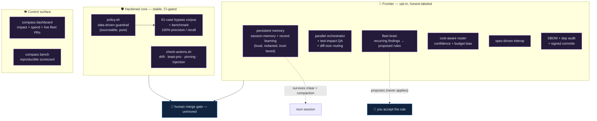

# The hardening + frontier layer

This is the implementation of the [competitive audit](15-competitive-audit.md)'s
recommendations (R1–R14): every gap the audit found against the 2026 field, built
production-grade, **all opt-in where it adds spend or risk**, every safety-critical
piece **gated by a test in CI**, and the **human merge gate untouched**. Nothing here
changes the product's spine — readable config, reversible install, you always merge.

> **Maturity:** the hardening set (guardrail, drift/actions, bench) is stable and
> CI-gated. Memory, the fleet brain, parallel orchestration, and the cost-aware router
> are opt-in and labeled experimental in the same honest spirit as the rest of the repo.

<p align="center">
  
</p>

<p align="center"><sub>↑ the hardening + frontier layer. Below, the same layer as a text diagram:</sub></p>



---

## Hardening (stable, CI-gated)

### Guardrail policy engine + bypass corpus (R1, R2, R10)
The guardrail is now a **pure, sourceable policy** in
[`claude/hooks/lib/policy.sh`](../claude/hooks/lib/policy.sh) — two functions
(`danger_reason`, `secret_file_reason`) that `protect-paths.sh` adapts to the hook
contract. Every bypass the audit found is closed:

| Was bypassable by | Now |
|---|---|
| `rm -r -f /`, `rm --recursive --force /` (split/long flags) | blocked (flag-form agnostic) |
| `rm -rf "$HOME"` (quoted), `/usr` `/etc` … (system dirs) | blocked |
| `find / -delete` / `-exec rm` | blocked |
| `curl …\|sh` (no space), `\| zsh`, `\| sudo bash`, `<(curl)`, `eval "$(curl)"` | blocked |
| `git push origin +main` (plus-refspec), `git -c k=v push --force` | blocked |

This is **"policy-as-code with an eval"**: [`scripts/test-protect-paths.sh`](../scripts/test-protect-paths.sh)
is a 147-case labeled corpus (must-block / must-allow; distinct from the 61-case
`compass bench` corpus) — the highest-stakes file finally
has a test, and it found 3 real bugs while being written. Still footgun-prevention, **not
a security boundary** — unchanged framing.

### Third-party plugin scanner — `compass audit-plugin` (R1 extension)

Before installing a plugin from any marketplace or config repo, scan it:

```bash
compass audit-plugin /path/to/plugin-dir
compass audit-plugin /path/to/plugin-dir --json               # machine-readable
compass audit-plugin /path/to/plugin-dir --baseline my.tsv   # suppress known findings
```

Checks five categories: (a) injection patterns in `.md` files and MCP tool descriptions,
(b) unpinned MCP servers (`@latest` or no version pin), (c) hook scripts that
fetch-and-execute from the network or write outside the plugin dir, (d) scripts that write
to `~/.claude/settings*` or `CLAUDE.md`, and (e) executable payloads (base64-decode-and-run,
eval of downloaded content). Exits 0 = clean (or only INFO + baselined), 1 = HIGH/MED
findings, 2 = usage error. Never executes target code.

**Why `--baseline` is CLI-only, never read from inside the plugin.** A plugin that could
supply its own baseline could suppress any finding against itself, defeating the scanner.
Suppression is operator-controlled only — pass a `path<TAB>rule` file you wrote.

### GitHub Actions audit (R3, R4)
[`scripts/check-actions.sh`](../scripts/check-actions.sh) gates four things in CI:
**mirror drift** (`.github/workflows/sdlc-*` must equal the `sdlc/workflows/` templates —
closes the audit's DRIFT finding), **least privilege** (every workflow declares
`permissions:`), **SHA-pinning**, and **script injection** (a state machine rejects
untrusted `${{ github.event.* }}` inside a `run:` block).

### Reproducible benchmark (R8)
`compass bench` — guardrail **100% precision / 100% recall** over 61 cases, router
**96.9%** accuracy — deterministic, CI-gated on floors. The model-driven SDLC fix-rate
bench (`compass bench --sdlc <fixtures>`) is a documented, locally-runnable harness
(needs tokens; honestly **not** CI-gated).

---

## Frontier (opt-in, experimental)

### Persistent cross-repo memory (R5) — *the highest-leverage gap*
Two opt-in hooks over the existing [`compass-memory`](../mcp/compass-memory/) store
(local SQLite, redaction + trust tiers, [ADR-0001](adr/0001-cross-repo-memory.md)):
- **`session-memory.sh`** (SessionStart, read): injects this repo's recent durable
  learnings — survives `/clear`, compaction, and moving to a sibling repo.
- **`record-learning.sh`** (Stop/SubagentStop, write): persists only the lines the agent
  explicitly marks `LEARNED:` / `MEMORY:`, each run through the secret-scrubber.

**Enable:** set `COMPASS_MEMORY_TRUST='<repo>:read-write'` and wire the hooks under
`hooks.SessionStart` / `hooks.Stop` in `settings.json`. Off by default → silent no-op.

### Parallel orchestrator + test-impact + diff-size routing + spec-driven interop (R7, R9, R13)
`orchestrate.sh`, all opt-in, default path byte-for-byte preserved:
- `SDLC_PARALLEL=1` — the three independent read-only final passes (audit, security, QA)
  run concurrently on the converged HEAD. Same semantics, lower wall-clock.
- `SDLC_TEST_IMPACT=1` — run only tests affected by the diff (`go test ./pkg/...`,
  `jest --findRelatedTests`, changed pytest files), full-suite fallback.
- Diff-size routing — ≤25-line diffs review on haiku; security stays opus.
- **spec-driven interop** — auto-discovers `.specify/specs/*/spec.md`, `specs/*/spec.md`,
  `spec.md`, so compass is the governance+execution layer *under* spec-driven frameworks.

### Cost-aware router (R11)
`compass route --score` adds a 0–99 confidence; `COMPASS_ROUTE_BUDGET_BIAS=low`
downgrades only weakly-held sonnet defaults to haiku. The deterministic keyword tier
stays the **hard floor** (high-stakes work is never downgraded) so the CI eval is intact.

### Fleet brain (R12)
`compass policy-synth` clusters recurring review/security findings into **proposed**
CLAUDE.md rules — it **edits nothing**; a human accepts them. The opt-in
[`sdlc/routines/policy-synth.yml`](../sdlc/routines/policy-synth.yml) runs the LLM variant
weekly and files an **issue** (never a PR, never a merge). The self-improving loop, kept
auditable and human-gated.

### OpenSSF Scorecard (supply-chain posture)

`.github/workflows/scorecard.yml` runs the [OpenSSF Scorecard](https://securityscorecards.dev/)
action weekly (Monday 03:17 UTC) and on every push to `main`. It publishes SARIF results to the
GitHub code-scanning dashboard and uploads SARIF as a workflow artifact (retained 5 days). The
workflow uses `read-all` permissions at the top level with only the two scopes the action
requires (`security-events: write`, `id-token: write`) added at the job level — it passes
compass's own `check-actions.sh` least-privilege gate.

### Provenance: SBOM + signed commits (R14)
`compass sbom` emits a dependency SBOM (prefers `syft`) + native vuln audit
(npm/govulncheck/cargo-audit/pip-audit); `--gate` fails on known vulns. In the loop:
`SDLC_SIGN=1` signs Builder commits, `SDLC_SBOM=1` attaches a Provenance section to the
PR, `SDLC_SBOM_GATE=1` drafts the PR on a known vuln.

---

## Control surface (R6)
`compass dashboard` — one read-only panel composing the local ledgers (footguns blocked,
files formatted, spend, $ saved) with **live fleet PR state** via `gh`. `--json` for
machines, `--html` writes a shareable static page. No service, no upload; graceful no-op
without `gh`. This answers "I can't *see* the fleet" without betraying the no-service
principle.

---

## How it maps to the product goal
compass's thesis is *configuration is the edge, and trust is the moat.* Each addition
serves that: the guardrail/corpus/bench make the trust **measurable**; memory + the fleet
brain make the configuration **self-improving** (but human-accepted); parallel/router/
test-impact make it **cheaper and faster**; the dashboard makes it **visible** — all
while the human merge gate, readable config, and reversible install stay exactly where
they were. → see the updated [roadmap](10-roadmap.md) and [competitive audit](15-competitive-audit.md).
