# Loop engineering in practice — the five moves, mapped to compass

*The thesis ([loop-engineering.md](loop-engineering.md)) argues that **iteration under a gate beats
one confident guess**. This page is the operational companion: it decomposes a self-running loop
into the parts you actually build, and shows which compass primitive realizes each — so you can
assemble a loop that runs while you sleep without it running away.*

## One floor above the harness

The "engineering" terms stack, each minding something larger than the one below:

| Layer | Minds | The unit |
|---|---|---|
| **Prompt** | what to say to the model | one exchange |
| **Context** | what's in the window now | one window |
| **Harness** | arming a single run — tools, actions, what "done" means | one run |
| **Loop** | making the run repeat itself — on a timer, spawning helpers, feeding itself | a loop |

Loop engineering moves you from *operating* the agent to *designing the system that operates it*.
That power cuts both ways: the higher the layer, the farther you are from the scene, and the
longer a mistake survives before anyone catches it. A bad prompt is caught on the spot; a bad
loop writes its mistake into a state file and builds on it for days. So the real work of a loop
is never building it — it's **putting something inside that can say "no."**

## The five moves of one turn

Every turn of a loop does five concrete things. Drop one and the loop won't turn, or turns in
place. compass has a primitive for each:

<p align="center"></p>

| Move | What it does | compass primitive |
|---|---|---|
| **Discovery** | find this turn's work (don't be handed it) | the [`morning-triage`](../claude/skills/morning-triage/SKILL.md) skill + routine — reads failed CI · new issues · merged commits |
| **Handoff** | hand each task off, isolated | a git **worktree** per task ([dynamic workflows](13-workflows.md) take `isolation:'worktree'`; the SDLC loop uses a branch/PR) |
| **Verification** | the move that can say **no** | an **evaluator subagent** ([code-reviewer](12-every-agent.md) / [reviewer role](09-sdlc.md)) — assumes broken, runs it |
| **Persistence** | state that survives the conversation | a **state file** (`state/triage.md` / a pinned tracking issue) + [Serena memory](04-mcp.md) |
| **Scheduling** | make it turn again, on its own | a **cloud routine** (`sdlc/routines/*.yml`) or local [`compass schedule`](11-using-compass.md) |

One loop needs no schedule at all: **CI auto-fix** ([`sdlc-ci-fix.yml`](09-sdlc.md)) turns the
moment a check suite goes red — PR failures feed the existing fix loop (round-capped), a
default-branch failure gets one free rerun then a budget-capped `ci-fix/*` PR. The local
no-Actions form is `compass schedule add ci-watch --daily`.

Discovery sets the ceiling: surface work of no value and the other four are done beautifully in
service of nothing. That's why discovery lives in a **skill** (knowledge made permanent), not a
wall of instructions pasted into a schedule nobody will update.

## The hard part: generator vs evaluator

Ask the agent that wrote the code whether the code is good and it praises itself — it isn't a
smarts problem, it's grading your own homework. The context that wrote the code is full of the
reasons it was written that way, so the author sees its own chain of self-persuasion, not the
result. The fix is **structural, not a better prompt**: a separate evaluator with different
instructions that looks at the work from scratch.

compass builds the evaluator in by default, and tunes it the way the playbook prescribes:

- **A different agent, not self-review.** The [Reviewer role](../sdlc/roles/reviewer.md) and the
  [`code-reviewer`](../claude/agents/code-reviewer.md) agent are separate from the Builder, on a
  fresh context (and often a different model).
- **Defaults to doubt.** Both now carry the stance *assume the change is broken until proven
  otherwise* — a reviewer that has never once said "no" isn't reviewing.
- **Acts, doesn't just read.** The evaluator **runs the tests and pastes the real output**, checks
  the diff against `specs/<slug>.md` acceptance criteria if present, and for UI changes drives the
  page through a browser MCP (Playwright / claude-in-chrome) — judging behavior, not how the JSX reads.
- **A fresh judge on the stop condition.** Completion is decided by a check, not by the worker
  declaring victory (see *run until a condition* below).

> The dynamic [workflows](13-workflows.md) push this further: every finding is **adversarially
> verified** by an independent skeptic before it's reported, so a plausible-but-wrong finding
> doesn't survive.

## Run until a condition, not just N rounds

A loop should stop when the work is *done*, judged by **something other than the worker**. The
converge loop in `orchestrate.sh` does this directly with a goal-gate:

```bash
SDLC_CONVERGE=1 SDLC_GOAL="all tests in test/auth pass and the lint step is clean" \
  ~/compass/sdlc/orchestrate.sh "harden the auth flow"
```

- **A fresh model judges the condition.** When `SDLC_GOAL` is set, after each fix→re-review round
  a *separate, cheap* model (the [goal-judge role](../sdlc/roles/goal-judge.md), haiku by default,
  `SDLC_GOAL_MODEL` to override) decides whether the stop condition holds — by **running the
  tests/lint**, not by reading the diff. Completion is decided by a different model than the one
  doing the work (maker/checker), exactly as the playbook prescribes.
- **Default-to-doubt.** Anything but a clear `SDLC-GOAL: MET` counts as UNMET, so the loop keeps
  going (up to the round cap) until *proven* done — a judge that can't run the check is not a pass.
- **The loop runs until BOTH hold:** the reviewer is CLEAN *and* the goal is MET; otherwise it
  fixes and re-checks, bounded by `SDLC_MAX_FIX_ROUNDS` (default 3).

Layered on top: if a `specs/<slug>.md` exists the reviewer checks the diff against its acceptance
criteria; the PR's review + QA checks are required; and an agent can mark *reviewed-clean* but
never merge. The round cap is the backstop, the condition is the goal — so a non-converging loop
stops *spending* and hands off to a human (the goal verdict goes in the PR body) rather than
nodding at itself forever.

## The four silent costs — and the compass guard for each

A loop that runs itself is a loop that errs by itself, and the costs accrue silently — no alarm
sounds while the loop is running. They reinforce one another: unverified output erodes
understanding, which invites surrender, which lets the loop run longer and spend more. Guard all
four or none holds.

<p align="center"></p>

| Cost | What it is | compass guard |
|---|---|---|
| **Verification debt** | unverified output piles up between "runs" and "right" | an independent **evaluator** that assumes broken and *acts* (above) |
| **Comprehension rot** | code you didn't write outpaces the map in your head | [`compass digest`](#compass-digest) — samples merged changes, makes you explain them |
| **Cognitive surrender** | you stop having an opinion, take whatever it hands back | the permanent **human gate** — the loop executes, you decide & merge |
| **Token blowout** | helpers + retries spin all night into a surprise bill | the [budget caps](#budget-caps) — per-run, **per-day**, and live session ceiling |

### <a id="compass-digest"></a>`compass digest` — the comprehension-rot guard

The defense against comprehension rot is not to read everything (that defeats the loop) but to
read a **representative sample, regularly**, and force yourself to explain each change. An
inability to explain is the precise signal your mental map has fallen behind.

```bash
compass digest            # sample 3 recently-merged changes you didn't hand-write
compass digest -n 5       # a bigger sample
compass digest --all      # revisit, ignoring what you've already reviewed
```

It prefers agent-authored changes, shows each as a question — *"what did this do, and why this
way?"* — then reveals the recorded rationale so you can check your answer, and tracks what you've
seen in a ledger so each run surfaces **unreviewed** work and reports how far your map is behind.
Deterministic and local: no model call, nothing leaves your machine. Run it as a habit, or wire
it into a daily routine.

### <a id="budget-caps"></a>Budget caps — the token-blowout circuit breaker

Set the ceilings *before* the loop runs unattended, on the assumption something will spin idle
overnight — because eventually something will:

```bash
export COMPASS_MAX_USD=5          # live: halt THIS session at $5, before the next tool call
export COMPASS_MAX_USD_DAY=20     # live: halt once TODAY's total (session + loops) hits $20
compass spend --today --max-usd 20   # gate a routine on the day's cumulative spend (exit 2 = over)
```

Per-run caps already live on every routine (`--max-budget-usd`, `--max-turns`); the **daily** cap
is the new cross-run circuit breaker — a day of loops can't run away even if no single run does.
These aren't about saving money; they convert an open-ended risk into a bounded one. → [02-cost](02-cost-and-models.md)

Under the hood: the live gate drops a per-session breadcrumb at `${COMPASS_HOME:-~/.compass}/sessions/<session_id>.cost`,
and the daily cap adds today's rows of the shared ledger `${COMPASS_HOME}/spend.tsv` — useful when you want a
routine (or your own script) to read the same numbers the gate enforces.

## Reliability comes from the constraints, not the model

The most reliable production loops aren't built on a stronger model — they're built on stronger
*constraints*. The design rule: **anything deterministic logic can solve never goes to the
probabilistic model.** Where you draw that line decides whether the loop is reliable.

compass leans on this throughout:

- The `mission-digest` routine is **gh-only, no model** — pure deterministic state reconciliation.
- `morning-triage` keeps *discovery* (judgment) in the model but *persistence* (state, de-dup) and
  *handoff* (worktrees, labels) deterministic.
- Hard-coded gates the agent can't skip: the guardrail hooks, the required CI checks, the budget
  ceilings, and the human merge gate are all outside the model's control.

When you add to a loop, ask: *can a script decide this?* If yes, a script should — keep the model
for genuine judgment.

## Connectors decide the loop's radius of vision

A loop that can only see the filesystem is a tiny loop. **Connectors** (built on MCP) are what let
it see issues, CI, and chat — and they decide what discovery can find. compass ships a curated,
**version-pinned** set (`context7` · `fetch` · `git`; see [04-mcp](04-mcp.md)), audited by
`compass redteam`/`check-mcp`. Widen the radius deliberately: pin what you add, treat everything it
returns as **data, not instructions**, and never trade the supply-chain discipline for reach.

## Scheduling: local for frequency, cloud for autonomy

"Running while you sleep" is about the scheduler, not the model. The choice follows one question —
is the work glued to your machine, or can it leave?

| | Cloud routine | Local schedule / `/loop` |
|---|---|---|
| Runs on | a cloud machine | your machine (must stay on) |
| Min interval | ~1 hour | ~1 minute |
| Sees local files | no | yes |
| Survives a closed lid | **yes** | no |

A mature setup uses both: local for tight inner checks that need local state, **cloud
(`sdlc/routines/*.yml` on a CI schedule) for the overnight sweep** that must run with the lid
closed. → [scheduled routines](../sdlc/routines/README.md)

## Local-first: a zero-cost tier, audited first

Cheap and private work doesn't need a frontier model. The router ships a **local hybrid** profile:
mechanical/private tasks run on a zero-marginal-cost open-weight coder model over an
OpenAI-compatible endpoint, and only the hard, high-stakes minority escalates to the cloud.

```bash
compass route --profile local "reformat this file"     # → a local model, $0
compass route --profile local "redesign the auth model" # → opus (the escape hatch)
```

Before you point a harness at a local endpoint, **audit it** — the harness runs your code and
reads your files, so its blast radius is real:

- Inspect install scripts and package lifecycle hooks; check shell-execution and file-permission scopes.
- Audit secret handling and which env vars it inherits; examine network calls and **telemetry endpoints** (disable telemetry + auto-update).
- Test prompt-injection resistance against untrusted repo/tool output (`compass redteam`).
- Isolate it: a separate user/VM, or `compass sandbox` for untrusted code — a real OS boundary, not the guardrail.

The reward is predictable fixed cost, full privacy, and immunity to API price/availability
changes — with the cloud still one `--profile`-flip away for what local hardware can't carry.

## Build your first loop with compass

Keep it small enough to read in one sitting; install all five moves, not just the two that produce
visible output. The danger isn't a small loop — it's a loop with discovery and handoff but no
verification, persistence, or cap: one that nobody watches and nobody can stop.

1. **Discovery** — adopt the [`morning-triage`](../claude/skills/morning-triage/SKILL.md) skill so the loop finds its own work.
2. **Persistence** — let it reconcile `state/triage.md` (or the pinned triage-state issue) so tomorrow picks up where today left off.
3. **Handoff** — one worktree per finding, with a `goal=` stop-condition.
4. **Verification** — the evaluator (assumes broken, runs it) gates each change; nothing merges on the worker's say-so.
5. **Scheduling** — wire `sdlc/routines/morning-triage.yml` on a cloud cron (lid-closed) and feed findings into the [SDLC loop](09-sdlc.md).
6. **The guards** — set `COMPASS_MAX_USD_DAY` before the first unattended run, keep the human merge gate, and run `compass digest` as a daily habit.

## Stay the engineer

The same loop, built by two people, ends in opposite places — and the difference isn't in the
loop. One uses it to move faster on what they already understand; the loop scales judgment they
have. The other uses it to never have to understand again; six months later they're the gatekeeper
of a machine they can't read. A loop is a faithful multiplier of whatever you bring.

Loops make *generation* nearly free and leave *judgment* as the scarce resource. compass is built
so the judgment stays yours: the evaluator says no on your behalf, `compass digest` keeps your map
current, the budget caps stop the spend, and the merge button is always a human's. Build the loop —
but build it like someone who intends to stay the engineer, not just the one who presses go.

---

*See also: [the thesis](loop-engineering.md) · [the SDLC loop](09-sdlc.md) · [the fleet](14-fleet.md) · [dynamic workflows](13-workflows.md) · [cost & models](02-cost-and-models.md) · [scheduled routines](../sdlc/routines/README.md).*
