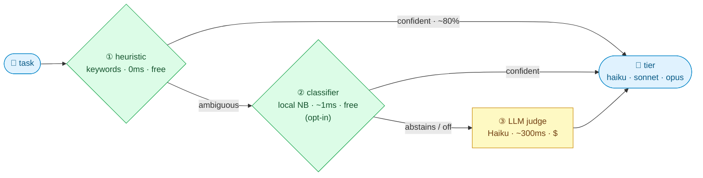
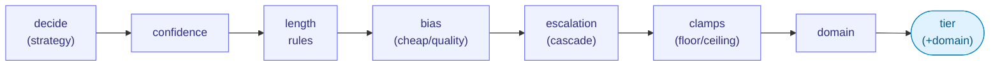
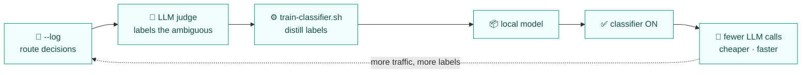

# router — a deterministic cost-tier router

<p align="center">
  
</p>

A tiny, dependency-free, **language-agnostic** model router: given a task description it
picks the cheapest tier that can do the job well (`haiku` / `sonnet` / `opus`). No network,
no model call, no training — a pure function of the task string and a rules spec.

It's deliberately *not* a cross-vendor quality-maximizer (OpenRouter / Not Diamond do that
with trained meta-models + an API round-trip). It's a **spend dial** you embed in your own
agent loop: microsecond, offline, deterministic, auditable. Per RouterBench, trained routers
only modestly beat trivial baselines on a realistic mix — so a good keyword+length heuristic
captures most of the savings with none of the latency/cost/dependency.



> **Pay for intelligence only where it's needed.** The free heuristic answers the confident
> majority in microseconds; the optional local classifier mops up most of the rest for free;
> the LLM judge is consulted only on the genuinely ambiguous tail. Layers ②/③ are opt-in —
> default routing is layer ① alone (zero network).

## The reusable asset is `router.json`

Everything routing-specific lives in [`router.json`](router.json) — tiers (rank + relative
cost + model id), the default tier, and an **ordered** list of `{tier, pattern, reason}` rules.
The algorithm any host implements is the same ~10 lines:

> lowercase the task → walk `rules` in order → first `pattern` (ERE, case-insensitive) that
> matches wins → else `default`.

Keep `router.json` as the single source of truth; `route.sh` is just the reference impl, and
`bench.sh` scores *any* implementation against `evalset.tsv`.

## Cache-aware cost-min (stage 4.5)

A small but distinctive stage that folds **prompt-cache economics** into the pick — the
prefix/KV-cache-aware idea (route same-prefix work to the already-warm tier), at the model-
selection layer. **OFF unless `COMPASS_ROUTE_WARM` names a tier whose prompt-cache prefix is
already hot this session.** When on, among the tiers in `[pick .. ceiling]` it rides a *warm
pricier* tier when its expected cost is lower than cold-loading the pick:

```
cost(tier) = (warm ? read_mult : write_mult)·tier.cost·P  +  tier.cost·D  +  tier.cost·out_weight·O
```

reusing each tier's relative `cost` (haiku 1 / sonnet 4 / opus 20). It models Anthropic's
cache pricing (read **0.1×**, 5m write **1.25×**, 1h write **2×**). The headline case:
**warm Sonnet beats cold Haiku once the task delta `D` is small relative to the cached prefix
`P`** — a small edit on a hot prefix. It is **upgrade-only** (never routes below the pick, so
quality can't drop) and the clamps stage still bounds it. Tunables live in the `cache` block of
`router.json`; override per run with `COMPASS_PREFIX_TOKENS` / `COMPASS_TASK_TOKENS` /
`COMPASS_OUTPUT_TOKENS` / `COMPASS_ROUTE_TTL`. `--ttl` recommends the cache-write TTL (5m vs 1h)
from `COMPASS_ROUTE_REUSES` / `COMPASS_ROUTE_GAP_MIN`. Full rationale + the honest reachable-levers
table: [`docs/adr/0004-cache-aware-routing.md`](../docs/adr/0004-cache-aware-routing.md).

> This is the one place the router goes *beyond* a plain cost dial: it accounts for the cache
> you've already paid to warm — deterministically, client-side, and gated by `test.sh`.

Measure it: `bench.sh --cache` scores the cache-aware picks on `cache-evalset.tsv` and reports
**effective $ saved vs cold** (cache read/write modeled), gated on 100% decision-accuracy and
savings > 0. `COMPASS_ROUTE_CACHELOG=<file>` records each decision; `bench.sh --calibrate <file>`
summarizes the realized cache-affinity rate.

## More cost dials (each OFF unless its signal is set)

- **Budget governor** (`budget` block; `COMPASS_ROUTE_BUDGET_USD` [+ `COMPASS_ROUTE_SPENT_USD`,
  else today's `spend.tsv`]). Near the cap it pulls back: at `warn_pct` it cheap-biases weak
  picks; at `cap_pct` it applies `cap_ceiling` as a hard cost cap. A deliberate operator dial.
- **Latency ceiling** (`--max-latency N` / `COMPASS_ROUTE_MAX_LATENCY`; per-tier `latency` in the
  spec). Caps the pick to the most-capable tier within the speed budget — multi-objective routing,
  still deterministic.

Full pipeline: `decide → confidence → length → bias → cache → escalation → budget → latency →
clamps → domain`. See [`docs/adr/0004-cache-aware-routing.md`](../docs/adr/0004-cache-aware-routing.md).

## Files

| File | What |
|------|------|
| `router.json` | the spec — tiers, costs, ordered rules, **`cache` block** (the asset to copy into other repos) |
| `route.sh` | reference implementation (bash + jq + grep) — `route.sh [--explain] "<task>"` |
| `evalset.tsv` | labeled ground truth: `split` (base / holdout / adversarial) · tier · task |
| `bench.sh` | accuracy **and cost-at-iso-quality**, gated; `--cache` scores cache savings; `--calibrate` reads telemetry |
| `cache-evalset.tsv` | labeled warm/cold set for `bench.sh --cache` (cache-aware cost-min savings) |
| `fallback-llm.sh` | opt-in escalation fallback — a Haiku judge for the ambiguous middle (stdin→tier) |
| `train-classifier.sh` | distill logged judgments into a local Naive-Bayes model (zero ML deps) |
| `classify.sh` | local classifier fallback (stdin→tier); abstains when off / no model / unsure |
| `fallback-cascade.sh` | the "both" fallback: classifier first (free), LLM judge for the rest |
| `bench-live.sh` | real (token-spending, non-CI) measurement of the fallback's accuracy lift |
| `router.local.json.example` | per-app overlay template (turn on the fallback, add rules) |
| `test.sh` | module unit tests |

## Embedding in another app

Load `router.json`, implement the matcher. Examples:

**Go**
```go
type Rule struct{ Tier, Pattern, Reason string }
type Spec struct{ Default string; Rules []Rule }
func Route(task string, s Spec) string {
    lc := strings.ToLower(task)
    for _, r := range s.Rules {
        if regexp.MustCompile("(?i)" + r.Pattern).MatchString(lc) { return r.Tier }
    }
    return s.Default
}
```

**Python**
```python
import json, re
spec = json.load(open("router.json"))
def route(task: str) -> str:
    lc = task.lower()
    for r in spec["rules"]:
        if re.search(r["pattern"], lc, re.I): return r["tier"]
    return spec["default"]
```

**TypeScript**
```ts
const spec = JSON.parse(await readFile("router.json", "utf8"));
export const route = (task: string): string =>
  spec.rules.find((r: any) => new RegExp(r.pattern, "i").test(task.toLowerCase()))?.tier
  ?? spec.default;
```

**Rust** — same shape with the `regex` crate (`Regex::new(&format!("(?i){}", r.pattern))`).

Whatever the host language, score it the same way: emit `split<TAB>expected<TAB>got` per
eval case and feed it through the same math `bench.sh` uses.

## Metrics — why not just "accuracy"

Routing literature (RouteLLM, RouterBench) reports **cost-at-iso-quality**, not classification
accuracy, because the "which tier" classifier is only modestly better than naive on a real mix.
`bench.sh` reports both:

- **accuracy** — exact tier match vs the label.
- **quality-retained** — % where the chosen tier is **≥ the minimum-adequate (label) tier**.
  This is the honest stand-in for "iso-quality": did we pick a capable-enough tier?
- **underserve** — % routed *below* adequate (the real quality risk; over-serving only wastes cost).
- **cost vs all-opus** — the savings (e.g. "39% of all-opus → saves 61%").
- **efficiency** — cost-optimal / router-cost (100% = spent exactly what each task needed).

### Splits
- **base** — the curated cases the rules were authored against (rule-coverage, expect high).
- **holdout** — fair, naturally-phrased, *not* used to tune rules (generalization).
- **adversarial** — keyword-free paraphrases + misleading-keyword cases. A **generalization
  probe**, not a quality gate — its floor is a regression *tripwire*. A low score here is the
  honest signal of where a heuristic needs help (e.g. an LLM-classifier fallback for the
  ambiguous middle), *not* something to fix by overfitting rules to the probe.

### Current numbers (`bash bench.sh`)
- base + holdout (fair distribution): **~98% accuracy, ~98% quality-retained, ~61% cheaper than all-opus**.
- adversarial: **~33% accuracy, ~47% underserve** — the real ceiling of pure keyword routing.

## Deterministic vs real (two layers of "iso-quality")

`bench.sh` is the **deterministic** layer: quality is modeled by the labeled minimum-adequate
tier. The **real** layer — run each tier on each task, judge the outputs, derive the true
quality-vs-cost curve — needs tokens and is non-deterministic. To add it, write a `bench-live.sh`
that emits the same `split<TAB>expected<TAB>got` TSV from real model runs/judgments; the same
cost math applies and the same floors gate it (just off the CI path).

## Knobs (v1.1)

The full pipeline — with no flags it reproduces v1.0 exactly (`strategy: first-match`,
`bias: balanced`, escalation off, clamps no-op). Each stage is a knob with a spec default
and a CLI/env override:



| Knob | Flag / env | What it does |
|------|-----------|--------------|
| **matching strategy** | `--strategy first-match\|max-hits\|weighted` | how a tier is chosen. `first-match` = ordered, first rule wins. `max-hits` = most *keyword* hits wins. `weighted` = Σ(hits × rule.weight). |
| **rule veto** | rule field `unless` (ERE) | a rule is skipped when its `unless` also matches — kills false positives (e.g. opus `auth` *unless* `typo`). |
| **length rules** | spec `length_rules: [{min_words, at_least}]` | raise the floor for long tasks (a 60-word "comment …" isn't trivial). |
| **bias** | `--bias cheap\|balanced\|quality` · `COMPASS_ROUTE_BIAS` | on **low-confidence** picks only: `cheap` downgrades a tier, `quality` upgrades — the cost↔quality dial. Confident picks are untouched. |
| **escalation (cascade)** | `--escalate-below N` · `--fallback "CMD"` | if confidence < N: run `CMD` (task on stdin → prints a tier) and use it; with no fallback, bump one tier. The hybrid: heuristic for the confident majority, a smart call for the ambiguous middle. |
| **clamps** | `--floor TIER` · `--ceiling TIER` · `--allow t1,t2` | hard bounds applied last. `ceiling` = cost cap (never opus); `floor` = quality SLA (never haiku); `allow` = explicit allowlist. |
| **pricing/model profiles** | `--profile NAME` (spec `profiles`) | per-tier cost/model override so `bench.sh` reflects *your* prices and each app maps tiers to its own models. |
| **domain axis** | `--domain` (spec `domains`) | also emit a specialist (ui/api/infra/docs/core) — a second, orthogonal classification. |
| **local overlay** | `--local FILE` (auto: `router.local.json`) | per-app/per-repo rules + scalar overrides without forking the base spec (local rules take priority). |
| **telemetry** | `--log FILE` | append `ts⇥tier⇥confidence⇥task` per call — feed real misroutes back into the evalset. |
| **output** | `--json` · `--score` · `--explain` | structured `{tier,confidence,model,cost,reason[,domain]}` · `tier⇥confidence` · reason on stderr. |

Measure any knob's tradeoff: `bench.sh --route-args "--bias cheap --ceiling sonnet"` reports the
cost-at-iso-quality under that setting. (Bias/escalation only move *low-confidence* picks, so they
barely shift the curated evalset — their effect shows on real ambiguous traffic.)

## The Haiku fallback (hybrid: cheap heuristic + a smart call for the middle)

`fallback-llm.sh` is the cascade's smart half: on a **low-confidence** pick it asks Claude
Haiku to choose the tier (it reads the task on stdin and prints one tier, from the spec's
own tier descriptions). The keyword heuristic stays in charge of the confident majority — the
LLM is consulted only on the ambiguous middle, where keyword routing under-serves.

Enable it (off by default — default routing makes zero network calls):
```bash
route.sh --escalate-below 75 --fallback "$PWD/fallback-llm.sh" "<task>"
# or persist in router.local.json — see router.local.json.example
```
- **Threshold ~75** escalates the *no-keyword* (default-tier, conf 45–70) picks — the ambiguous
  ones — while leaving confident keyword matches (opus/haiku, conf ≥75) deterministic.
- **Provider:** the `claude` CLI if present, else the Anthropic API (`ANTHROPIC_API_KEY`).
  Fail-safe: any error or unrecognized output → the spec default tier (never blocks routing).
- **Cost:** one Haiku call per escalated task. Measure whether it pays with
  `bench-live.sh` — it prints the adversarial accuracy / under-serve delta vs the extra calls.
  (CI stays deterministic and token-free; `bench-live.sh` is run by hand.)

## The three-layer cascade (heuristic → classifier → LLM)

The progression, each layer handling what the cheaper one can't — and you can **toggle the
middle layer off**:

1. **Heuristic** (`route.sh`) — free, 0ms, deterministic; handles the confident majority.
2. **Classifier** (`classify.sh`, **off by default**) — a tiny local Naive-Bayes model
   (`train-classifier.sh`), free + fast, no network. Used as a fallback layer once trained.
3. **LLM judge** (`fallback-llm.sh`) — Haiku, best zero-shot accuracy on the genuinely
   ambiguous middle; costs one call.

`fallback-cascade.sh` wires 2→3: try the classifier; if it **abstains** (off / no model /
margin < `min_margin`), fall through to the LLM. Wire the cascade as the escalation fallback:
```bash
route.sh --escalate-below 75 --fallback "$PWD/fallback-cascade.sh" "<task>"
```

**The data flywheel:** turn on `--log` → the LLM judge labels real traffic for free →
`train-classifier.sh router-log.tsv` distills those labels into the local model → flip the
classifier **on** (`ROUTER_CLASSIFIER=on` or `classifier.enabled=true`). Now the classifier
handles most of the middle for free and the LLM is called only on what the classifier itself
is unsure about.



**When to flip it on:** not before you have data and the per-call LLM cost/latency is the
bottleneck. For a 3-way tier decision the classifier's *accuracy* edge over the Haiku judge is
small — its win is **speed and cost at volume**, paid for by data you've already logged. Until
then, leave it off and let the LLM judge handle the middle.

```bash
ROUTER_CLASSIFIER=off   # default — classifier abstains, cascade uses the LLM judge
ROUTER_CLASSIFIER=on    # use the local model; LLM only for the model's own low-margin cases
```

## Roadmap
- Auto-grow the evalset from `--log` telemetry (ties into `compass policy-synth`).
- Swap the Naive-Bayes model for an embedding classifier if your task mix needs it.
